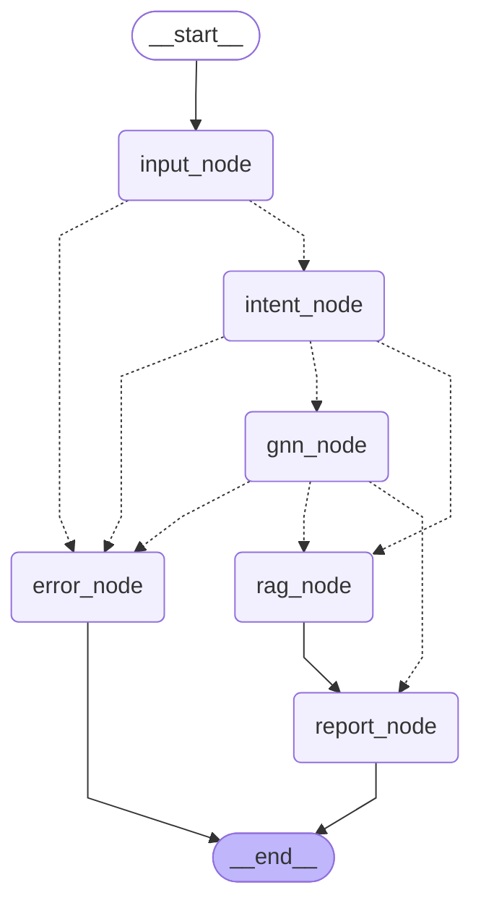

# ClinicalGNN-LLM Agent

> MIMIC-III 임상 데이터 기반 GNN + RAG 멀티턴 임상 추론 시스템  
> 김민혁 | [GitHub](https://github.com/arachne3/AI-agent)

---

## 서비스 소개

ClinicalGNN-LLM Agent는 실제 ICU 임상 데이터(MIMIC-III)를 활용하여 환자 ID를 입력하면 GNN 임베딩 기반으로 Top-5 예상 질병을 예측하고, 유사 임상 노트를 RAG로 검색하여 전문적인 임상 소견을 자동 생성하는 AI Agent입니다.

Flask 웹 인터페이스를 통해 브라우저에서 바로 사용할 수 있으며, 햄버거 메뉴에서 코호트 내 전체 환자 목록을 조회하고 클릭 한 번으로 질의할 수 있습니다.

---

## 사용 시나리오

### 기본 질의

| 입력 예시 | 동작 |
|-----------|------|
| `환자 1197번 예측해줘` | GNN으로 Top-5 질병 예측 + 바이탈 분석 |
| `환자 10006번 질병 예측해줘` | GNN으로 Top-5 질병 예측 + 바이탈 분석 |
| `환자 1197번 예측하고 질병 설명도 해줘` | GNN 예측 + RAG 검색 동시 수행 |
| `환자 10006번 예측하고 심부전 설명도 해줘` | GNN 예측 + RAG 검색 동시 수행 |

### 임상 노트 검색

| 입력 예시 | 동작 |
|-----------|------|
| `폐렴에 대해 임상노트 검색해줘` | MIMIC-III discharge summary RAG 검색 |
| `심부전 관련 임상노트 보여줘` | 심부전 관련 임상 노트 검색 |
| `패혈증 케이스 찾아줘` | 패혈증 관련 임상 노트 검색 |
| `급성 신부전 임상노트 검색해줘` | 급성 신부전 관련 임상 노트 검색 |
| `당뇨병 임상 사례 알려줘` | 당뇨병 관련 임상 노트 검색 |
| `MRSA 감염 사례 보여줘` | MRSA 관련 임상 노트 검색 |
| `폐색전증 임상노트 검색해줘` | 폐색전증 관련 임상 노트 검색 |
| `고혈압 환자 사례 검색해줘` | 고혈압 관련 임상 노트 검색 |

### 멀티턴 대화 (이전 대화 문맥 유지)

| 입력 예시 | 동작 |
|-----------|------|
| `이 환자 폐렴이랑 관련 있어?` | 직전 환자 ID 자동 유지 + RAG 검색 |
| `같은 환자 다시 예측해줘` | 직전 환자 ID 참조하여 재예측 |
| `방금 환자 심부전 설명해줘` | 직전 환자 문맥 유지 + 심부전 노트 검색 |
| `이 환자 당뇨랑 관련 있어?` | 직전 환자 ID 자동 유지 + RAG 검색 |

### 웹 UI 환자 목록 활용

1. 좌측 상단 **☰ 햄버거 버튼** 클릭
2. 사이드바에서 전체 환자 ID 목록 확인
3. ID 검색창으로 특정 환자 빠르게 찾기
4. 환자 카드 클릭 → 입력창에 질의 자동 채움

---

## 전체 아키텍처

### Workflow 다이어그램



### 노드 설명

| 노드 | 역할 |
|------|------|
| `input_node` | 사용자 입력 검증 및 파싱 |
| `intent_node` | LLM이 의도를 `predict / explain / both / unknown`으로 분류, 이전 대화 이력 및 대명사 참조 처리 |
| `gnn_node` | Tool A 호출 — GNN 코사인 유사도 기반 Top-5 질병 예측 |
| `rag_node` | Tool B 호출 — 쿼리 정제(한→영) 후 FAISS 벡터 검색, 유사도 필터링 |
| `report_node` | GPT-4o-mini로 최종 임상 소견 합성, 대화 이력 누적 |
| `error_node` | 에러를 사용자 친화적 메시지로 반환 |

### 조건부 분기

- `input_node` → 검증 실패 시 `error_node`, 성공 시 `intent_node`
- `intent_node` → `predict` → `gnn_node` / `explain` → `rag_node` / `both` → `gnn_node → rag_node`
- `gnn_node` → `both`이면 `rag_node`, `predict`이면 바로 `report_node`

---

## 설치 및 실행

### 요구사항

- Python 3.10 이상
- MIMIC-III 데이터 접근 권한 (physionet.org)
- OpenAI API Key

### 설치

```bash
git clone https://github.com/arachne3/AI-agent.git
cd AI-agent
pip install -r requirements.txt
```

### 환경변수 설정

프로젝트 루트에 `.env` 파일 생성:

```
OPENAI_API_KEY=sk-...
MIMIC_BASE_DIR=C:/path/to/MIMIC
VECTOR_STORE_PATH=./output/vector_store
FLASK_SECRET_KEY=임의문자열
RAG_SCORE_THRESHOLD=1.2
RAG_TOP_K=4
```

### 벡터 DB 빌드 (최초 1회)

```bash
python rag/rag_builder.py
```

> 상세 내용은 아래 [RAG 파이프라인 — rag_builder.py](#rag-파이프라인--rag_builderpy) 섹션 참고

### 실행

**웹 인터페이스 (권장)**
```bash
python app.py
# http://localhost:5000 접속
```

**터미널 인터페이스**
```bash
python main.py
```

---

## 컴포넌트 상세 설명

### Tool A — GNN 질병 예측 (`gnn_predict_tool`)

- MIMIC-III 환자 데이터를 GNN으로 학습한 임베딩(`z_patient.pt`, `z_disease.pt`) 활용
- 환자 벡터와 질병 벡터 간 코사인 유사도 계산 → Top-5 예측 반환
- ICD-9 코드 → 질병명 매핑 (`D_ICD_DIAGNOSES.csv`)
- 최근 24시간 바이탈 요약 (`clinical_prompts.json`) 함께 반환
- 모듈 로드 시 1회 캐싱으로 이후 호출 속도 최적화

### Tool B — RAG 임상 노트 검색 (`rag_search_tool`)

- MIMIC-III Discharge Summary를 FAISS 벡터 DB로 인덱싱
- **쿼리 정제**: 사용자 한국어 발화 → LLM 추출 → 영문 의학 키워드 변환
  - 예) `"폐렴에 대해 검색해줘"` → `"pneumonia"`
- **유사도 필터링**: FAISS L2 distance가 `RAG_SCORE_THRESHOLD` 초과 시 "관련 노트 없음" 반환 (LLM 환각 방지)
- 검색 결과에 유사도 점수 포함 출력

### RAG 파이프라인 — `rag_builder.py`

MIMIC-III의 `NOTEEVENTS.csv`(Discharge Summary)를 전처리하여 FAISS 벡터 DB를 구축하는 스크립트.

**처리 흐름:**

```
NOTEEVENTS.csv
  └─ CATEGORY == 'Discharge summary' 필터링
  └─ 텍스트 정제 (특수문자, 익명화 태그 제거)
  └─ RecursiveCharacterTextSplitter
       chunk_size=1000 / chunk_overlap=200
  └─ OpenAI text-embedding-3-small 임베딩
  └─ FAISS 인덱스 저장 → ./output/vector_store/
```

**주요 설계 결정:**
- `chunk_size=1000` — 임상 노트 1개 섹션(주요 소견, 약물 등)이 평균 800~1200자로 구성되어 섹션 단위 의미 보존
- `chunk_overlap=200` — 섹션 경계에서 문맥 단절 방지
- `text-embedding-3-small` — 영문 의학 텍스트에서 `ada-002` 대비 검색 품질 유지하면서 비용 절감
- 메타데이터(`subject_id`, `hadm_id`)를 청크와 함께 저장하여 검색 결과에서 환자 추적 가능

### Memory / 상태 관리

- `AgentState` — LangGraph StateGraph 전체 공유 상태
- `ConversationTurn` — 턴별 기록 구조체 (입력, 의도, 환자 ID, 예측 결과, RAG 쿼리)
- `conversation_history` — `_append_turns` reducer로 세션 내 누적 보장
- **대명사 참조 해소**: `"이 환자"`, `"방금 그 환자"` 등 키워드 감지 시 `last_patient_id` 자동 주입
- 웹 모드에서는 Flask session ID 기반으로 사용자별 상태 분리

### Middleware

| 미들웨어 | 기능 |
|----------|------|
| `log_user_input` | 사용자 입력 로깅 |
| `log_intent` | 분류된 의도 로깅 |
| `log_tool_call` | Tool 호출 인자 로깅 |
| `log_tool_result` | Tool 반환값 로깅 |
| `log_final_report` | 최종 리포트 생성 로깅 |
| `validate_input` | 빈 입력 / 이상 입력 검증 |
| `safe_node` | 노드 실행 중 예외 포착 및 `error_node` 라우팅 |
| `log_error` | 에러 상세 로깅 |

### OutputParser

`IntentOutput` (Pydantic) — `intent_node`에서 LLM 응답을 구조화 파싱:

```python
class IntentOutput(BaseModel):
    intent: str        # predict | explain | both | unknown
    patient_id: int | None
    reasoning: str
```

### 웹 UI — 햄버거 메뉴 환자 목록

- 헤더 좌측 **☰ 버튼** 클릭 시 사이드바 슬라이드 오픈
- `/patients` API 호출 → GNN 캐시에서 코호트 내 전체 환자 ID 로드
- **실시간 검색**: ID 입력 시 즉시 필터링
- **페이지네이션**: 15명씩 페이지 분할
- 환자 카드 클릭 → 입력창에 `"환자 {ID}번 예측해줘"` 자동 채움
- 사이드바 외 영역 클릭 또는 환자 선택 시 자동 닫힘

---

## 프로젝트 구조

```
AI-agent/
├── app.py                  # Flask 웹 서버 (햄버거 메뉴 포함)
├── main.py                 # 터미널 실행 진입점
├── draw_graph.py           # Mermaid 다이어그램 출력
├── requirements.txt
├── .env                    # API Key (Git 제외)
├── agent/
│   ├── graph.py            # LangGraph StateGraph 정의
│   └── state.py            # AgentState / ConversationTurn 스키마
├── tools/
│   └── tools.py            # GNN / RAG Tool 정의
├── middleware/
│   └── middleware.py       # 로깅, 검증, 에러 처리
├── rag/
│   └── rag_builder.py      # FAISS 벡터 DB 구축 스크립트
├── pipeline/               # GNN 모델 학습 및 임베딩 생성
│   ├── model.py
│   ├── graph_builder.py
│   ├── load.py
│   └── batch_eval.py
└── output/
    └── vector_store/       # FAISS 벡터 DB (Git 제외)
```

---

## 한계점 및 향후 개선 방향

### 현재 한계점

- **GNN 예측 신뢰도 낮음**: 코사인 유사도가 0.5 미만인 경우가 많아 예측 정확도 제한적
- **RAG 청크 품질**: Discharge Summary 전문을 청킹할 때 문맥이 잘리는 경우 발생
- **세션 휘발성**: 서버 재시작 시 대화 이력 소실 (DB 미연동)
- **단일 언어 임베딩**: 한국어 쿼리를 영어로 변환하는 과정에서 의미 손실 가능
- **반복(loop) 미구현**: RAG 검색 실패 시 자동 재시도 로직 없음

### 향후 개선 방향

- **예측 신뢰도 향상**: GNN 모델 고도화 (GAT, GraphSAGE 등 아키텍처 실험)
- **RAG 품질 개선**: 청크 크기 최적화, re-ranking 모델 도입
- **retry loop 추가**: RAG 결과 없을 시 쿼리 재작성 후 재검색 (LangGraph loop)
- **영구 메모리**: Redis 또는 SQLite 기반 세션 저장으로 대화 이력 영속화
- **스트리밍 응답**: SSE(Server-Sent Events)로 토큰 단위 실시간 출력
- **멀티모달 확장**: 흉부 X-ray 이미지 + 임상 노트 통합 분석

---

## 참고 및 출처

- [MIMIC-III Clinical Database](https://physionet.org/content/mimiciii/1.4/) — PhysioNet
- [LangChain Documentation](https://docs.langchain.com/)
- [LangGraph Documentation](https://langchain-ai.github.io/langgraph/)
- [FAISS](https://github.com/facebookresearch/faiss) — Facebook AI Research
- [OpenAI API](https://platform.openai.com/docs/)
- [Flask](https://flask.palletsprojects.com/)
